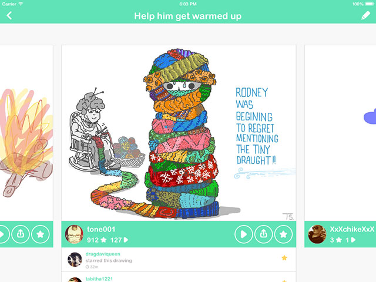
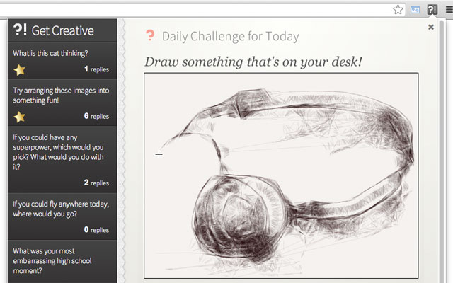
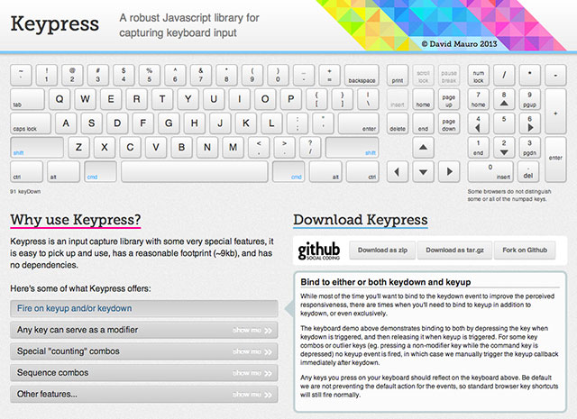

Projects
========
###DrawQuest###
[drawquest.com](http://drawquest.com)

DrawQuest is a social drawing app with a very simple toolset and daily challenges making it easy for anyone to make a drawing everyday. I helped maintain the app and was crucial to bringing the app to iPhone/iPod Touch and iOS 7.

-----

###GetCreative###
[https://github.com/canvasnetworks/get-creative](https://github.com/canvasnetworks/get-creative)

I designed and implemented all aspects of GetCreative to explore possible solutions for getting people into the creative habit. It is a Chrome extension and accompanying Node.js website that delivers daily challenges that can be completed in-browser. The extension leverages the power of the Chrome extension for app-like notifications while taking advantage of a Node.js for a fast dev and deploy cycle.

-----

###Keypress###
[http://dmauro.github.io/Keypress](http://dmauro.github.io/Keypress)

Keypress is a hobby project I've been actively working on for some time now. It allows for very complex keyboard bindings to be created. I started on this as I was working on a JavaScript based video game and realized I needed more complex bindings than other similar libraries afforded.

-----

###Others###
See what else I've been up to: [http://github.com/dmauro](http://github.com/dmauro)